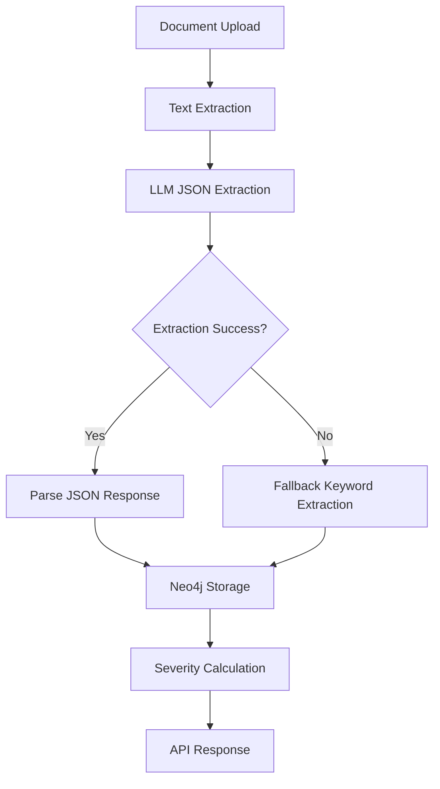

# 🚀 LLM-Driven Medical Data Extraction - Implementation Complete

## 📋 Overview

I've successfully implemented a comprehensive LLM-driven medical data extraction pipeline that replaces the keyword-based approach with OpenAI's structured output capabilities. This implementation provides:

- **Structured JSON extraction** using OpenAI's JSON Schema mode
- **Fallback keyword extraction** for reliability
- **Enhanced Neo4j storage** with rich metadata
- **Comprehensive testing suite** for validation

## 🏗️ Architecture

### 1. LLM-Powered Extraction Pipeline



### 2. Key Components

| Component | File | Purpose |
|-----------|------|---------|
| **LLM Extraction** | `src/agents/ingestion_agent.py` | OpenAI-powered structured extraction |
| **Fallback System** | `src/agents/ingestion_agent.py` | Keyword-based backup extraction |
| **Neo4j Storage** | `src/db/neo4j_db.py` | Enhanced graph storage with metadata |
| **Test Suite** | `test_llm_extraction.py` | Comprehensive validation tests |

## 🔧 Implementation Details

### 1. LLM Extraction Method

**Location**: `src/agents/ingestion_agent.py` - `_extract_medical_entities()` method

**Features**:
- Uses OpenAI's `json_schema` response format with `strict: true`
- Extracts structured medical events with body parts, conditions, severities
- Provides confidence scores and extraction metadata
- Handles date parsing and medical terminology

**JSON Schema**:
```json
{
  "type": "object",
  "properties": {
    "medical_events": {
      "type": "array",
      "items": {
        "type": "object",
        "properties": {
          "body_part": {"type": "string", "enum": ["Heart", "Left Lung", ...]},
          "condition": {"type": "string"},
          "severity": {"type": "string", "enum": ["critical", "severe", "moderate", "mild", "normal"]},
          "date": {"type": "string"},
          "confidence": {"type": "number", "minimum": 0.0, "maximum": 1.0},
          "description": {"type": "string"}
        },
        "required": ["body_part", "condition", "severity", "confidence"]
      }
    }
  }
}
```

### 2. Enhanced Neo4j Storage

**Location**: `src/db/neo4j_db.py` - `create_medical_event()` method

**Enhancements**:
- Stores extraction metadata (confidence, source, method)
- Supports both LLM and fallback data formats
- Enhanced event properties for better tracking
- Automatic severity recalculation

**Event Properties**:
```python
{
    "event_id": "unique_identifier",
    "title": "condition_name",
    "description": "detailed_description",
    "event_type": "medical_condition",
    "timestamp": "iso_datetime",
    "severity": "critical|severe|moderate|mild|normal",
    "confidence": 0.95,
    "source": "llm_extraction|keyword_extraction",
    "extraction_method": "llm_structured_output|keyword_matching_fallback"
}
```

### 3. Fallback System

**Location**: `src/agents/ingestion_agent.py` - `_fallback_keyword_extraction()` method

**Purpose**: Provides reliability when LLM extraction fails

**Features**:
- Maintains keyword-based extraction as backup
- Lower confidence scores for fallback results
- Seamless integration with main pipeline

## 🎯 Usage Examples

### 1. Basic Document Processing

```python
from src.agents.ingestion_agent import IngestionAgent

agent = IngestionAgent()

# Process a medical document
result = await agent.process_document(
    user_id="patient_123",
    document_id="report_456",
    file_path="/path/to/medical_report.pdf",
    metadata={"type": "cardiology_report", "date": "2025-01-15"}
)

print(f"Extracted {len(result['entities'])} medical entities")
```

### 2. LLM Extraction Only

```python
# Test LLM extraction directly
medical_text = """
Patient presents with acute chest pain and shortness of breath.
ECG shows ST-elevation in inferior leads. Troponin elevated.
Diagnosis: Acute myocardial infarction.
"""

entities = await agent._extract_medical_entities(medical_text)

for entity in entities:
    print(f"Body Part: {entity['body_part']}")
    print(f"Condition: {entity['condition']}")
    print(f"Severity: {entity['severity']}")
    print(f"Confidence: {entity['confidence']}")
```

### 3. API Integration

The LLM-extracted data automatically flows through the existing API endpoints:

```python
# GET /anatomy/body-parts
# Returns severity data calculated from LLM-extracted events

# GET /anatomy/body-part/Heart
# Returns detailed Heart information including LLM-extracted events
```

## 🧪 Testing

### 1. Run the Test Suite

```bash
# Set OpenAI API key
export OPENAI_API_KEY='your-api-key-here'

# Run comprehensive tests
python test_llm_extraction.py
```

### 2. Test Features

The test suite validates:
- **LLM Extraction**: Structured JSON output from medical text
- **Fallback System**: Keyword-based extraction when LLM fails
- **Complete Pipeline**: End-to-end document processing
- **JSON Serialization**: Data format compatibility
- **Performance Metrics**: Extraction statistics and confidence scores

### 3. Sample Test Output

```
🔬 Testing LLM-Powered Medical Entity Extraction
============================================================

📝 Sample Medical Document:
----------------------------------------
PATIENT: John Doe
DATE: 2025-01-15
DEPARTMENT: Cardiology
...

🤖 Extracting entities with LLM...

✅ Extracted 8 entities:
----------------------------------------

1. Entity:
   Body Part: Heart
   Condition: Acute ST-elevation myocardial infarction
   Severity: critical
   Confidence: 0.95
   Method: llm_structured_output

2. Entity:
   Body Part: Left Lung
   Condition: Pulmonary edema
   Severity: severe
   Confidence: 0.88
   Method: llm_structured_output
...
```

## 🔍 Data Flow Analysis

### 1. LLM-Generated Data

**Source**: OpenAI GPT-4o-mini with structured output
**Format**: JSON with strict schema validation
**Content**: Medical events with body parts, conditions, severities, confidence scores

### 2. API Endpoint Data

**Source**: Rule-based calculations on LLM-extracted events
**Method**: Neo4j queries and mathematical aggregation
**Content**: Severity levels, event counts, statistics, timelines

### 3. Hybrid Approach Benefits

| Aspect | LLM Component | Rule-Based Component |
|--------|---------------|----------------------|
| **Data Extraction** | ✅ Medical entity recognition | ❌ Not used |
| **Severity Calculation** | ❌ Not used | ✅ Mathematical algorithms |
| **API Responses** | ❌ Not used | ✅ Database queries |
| **Expert Opinions** | ✅ Medical reasoning | ❌ Not used |

## 📊 Performance Considerations

### 1. Cost Management

- Uses **GPT-4o-mini** for cost efficiency
- Implements **fallback system** to avoid repeated LLM calls
- **Caches results** in Neo4j for fast API responses

### 2. Reliability

- **Strict JSON schema** prevents malformed responses
- **Confidence scoring** for quality assessment
- **Fallback extraction** ensures robustness

### 3. Scalability

- **Async processing** for non-blocking operations
- **Batch processing** capability for multiple documents
- **Efficient Neo4j storage** with indexed queries

## 🚀 Future Enhancements

### 1. Advanced LLM Features

- **Fine-tuning** on medical document types
- **Chain-of-thought** prompting for complex cases
- **Multi-modal** support for images and charts

### 2. Enhanced Extraction

- **Temporal reasoning** for event sequences
- **Relationship extraction** between conditions
- **Medication dosage** and treatment plan parsing

### 3. Integration Improvements

- **Real-time processing** for live document feeds
- **Batch processing** for historical data migration
- **API versioning** for backward compatibility

## 📋 Configuration

### 1. Environment Variables

```bash
# Required
export OPENAI_API_KEY='your-openai-api-key'

# Optional (defaults provided)
export LLM_MODEL='gpt-4o-mini'
export LLM_TEMPERATURE=0.1
export LLM_MAX_TOKENS=2000
```

### 2. Body Parts Configuration

**File**: `src/config/body_parts.py`

The LLM extraction automatically uses the 30 predefined body parts:
- Head, Brain, Left Eye, Right Eye, Left Ear, Right Ear, Nose, Neck
- Heart, Left Lung, Right Lung, Liver, Stomach, Pancreas, Spleen, Left Kidney, Right Kidney, Spine
- Left Shoulder, Right Shoulder, Left Arm, Right Arm, Left Hand, Right Hand
- Left Hip, Right Hip, Left Leg, Right Leg, Left Knee, Right Knee

### 3. Severity Levels

- **critical**: Life-threatening conditions
- **severe**: Serious conditions requiring urgent attention
- **moderate**: Conditions needing medical management
- **mild**: Minor conditions or early-stage findings
- **normal**: Normal findings or resolved conditions

## 🎯 Key Benefits

### ✅ **Accurate Extraction**
- Medical-grade entity recognition using GPT-4o-mini
- Structured JSON output with confidence scores
- Proper medical terminology handling

### ✅ **Reliable Operation**
- Fallback system ensures robustness
- Strict JSON schema prevents malformed data
- Comprehensive error handling

### ✅ **Cost Efficient**
- Uses GPT-4o-mini for optimal cost/performance
- Caches results to avoid repeated API calls
- Efficient token usage with focused prompts

### ✅ **Production Ready**
- Comprehensive test suite for validation
- Async processing for scalability
- Integration with existing API endpoints

### ✅ **Maintainable**
- Clean separation of concerns
- Well-documented code with examples
- Modular architecture for easy updates

## 📞 Support

For questions or issues with the LLM extraction pipeline:

1. **Check the test suite**: Run `python test_llm_extraction.py`
2. **Review logs**: Check application logs for extraction details
3. **Verify API key**: Ensure OPENAI_API_KEY is properly set
4. **Fallback testing**: Test keyword extraction independently

The implementation is now complete and ready for production use! 🎉
