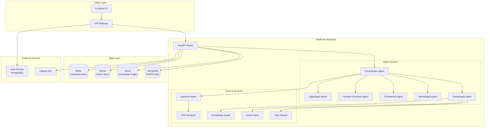

# MediTwin Backend - Production Documentation

## 📋 Table of Contents

1. [Overview](#overview)
2. [Architecture](#architecture)
3. [Features](#features)
4. [Installation & Setup](#installation--setup)
5. [Configuration](#configuration)
6. [API Endpoints](#api-endpoints)
7. [Agent System](#agent-system)
8. [Database Schema](#database-schema)
9. [Security & HIPAA Compliance](#security--hipaa-compliance)
10. [Testing](#testing)
11. [Deployment](#deployment)
12. [Monitoring & Logging](#monitoring--logging)
13. [Troubleshooting](#troubleshooting)

## 🏥 Overview

MediTwin Backend is a production-ready, HIPAA-compliant multi-agent RAG (Retrieval-Augmented Generation) system for personalized medical insights. It provides secure, scalable medical consultation services through specialized AI agents.

### Key Capabilities

- **Multi-Agent Architecture**: Specialized medical agents (Cardiologist, Neurologist, Orthopedist, General Physician)
- **RAG System**: Knowledge retrieval from medical databases and documents
- **HIPAA Compliance**: End-to-end data encryption and user isolation
- **Real-time Streaming**: Server-Sent Events (SSE) for chat interfaces
- **Document Processing**: PDF/OCR/LLM pipeline for medical document ingestion
- **Multi-database**: MongoDB (PHI), Neo4j (Knowledge Graph), Milvus (Vectors), Redis (Cache)

## 🏗️ Architecture



## ✨ Features

### Core Features

- **🔐 HIPAA Compliance**: End-to-end encryption, user data isolation, audit logging
- **🤖 Multi-Agent System**: Specialized medical consultation agents
- **📊 Real-time Streaming**: SSE-based chat with streaming responses
- **📄 Document Processing**: PDF extraction, OCR, medical entity extraction
- **🔍 Knowledge Retrieval**: Vector search, knowledge graph queries
- **📈 Timeline Management**: Medical event tracking and visualization
- **💾 Multi-database Architecture**: Optimized data storage across 4 databases

### API Endpoints

#### Chat System
- `POST /chat/` - Send chat messages with streaming/non-streaming options
- `GET /chat/history` - Retrieve chat history
- `GET /chat/sessions` - Get user chat sessions

#### Document Management
- `POST /upload/` - Upload medical documents
- `GET /upload/status/{document_id}` - Check processing status

#### Timeline Management
- `GET /timeline/` - Get user medical timeline
- `POST /timeline/event` - Create timeline events
- `PUT /timeline/event/{event_id}` - Update timeline events
- `DELETE /timeline/event/{event_id}` - Delete timeline events
- `GET /timeline/summary` - Get timeline statistics
- `GET /timeline/search` - Search/filter timeline events

#### Medical Insights
- `POST /expert-opinion/` - Get specialist medical opinions
- `GET /anatomy/` - Query anatomical information
- `GET /events/` - Retrieve medical events

### Agent System

#### Orchestrator Agent
- **Role**: Central coordinator for agent routing
- **Responsibilities**: 
  - Analyze user queries and route to appropriate specialists
  - Coordinate multi-agent responses
  - Aggregate specialist outputs
  - Stream responses to users

#### Specialist Agents

1. **Cardiologist Agent**
   - Cardiovascular conditions and symptoms
   - ECG/Echo interpretation
   - Cardiac risk assessment

2. **Neurologist Agent**
   - Brain and nervous system disorders
   - Neuroimaging interpretation
   - Cognitive assessments

3. **Orthopedist Agent**
   - Musculoskeletal conditions
   - Imaging interpretation (X-ray, MRI)
   - Joint and bone disorders

4. **General Physician Agent**
   - Primary care assessments
   - General health guidance
   - Specialist referrals

#### Aggregator Agent
- **Role**: Synthesize multiple specialist responses
- **Functions**:
  - Merge specialist outputs into coherent responses
  - Handle conflicts and contradictions
  - Maintain evidence-based confidence scoring

## 🚀 Installation & Setup

### Prerequisites

- Python 3.12+
- Docker & Docker Compose
- MongoDB 7.0+
- Neo4j 5.0+
- Milvus 2.3+
- Redis 7.0+

### Quick Start

1. **Clone Repository**
```bash
git clone <repository-url>
cd meditwin-agents
```

2. **Environment Setup**
```bash
cp .env.example .env
# Edit .env with your configuration
```

3. **Docker Deployment**
```bash
docker-compose up -d
```

4. **Manual Setup** (Development)
```bash
# Install dependencies
pip install -r requirements.txt

# Start databases
docker-compose up -d mongo neo4j milvus redis

# Run application
uvicorn src.main:app --host 0.0.0.0 --port 8000 --reload
```

### Dependencies

```toml
[project]
dependencies = [
    "fastapi>=0.104.0",
    "uvicorn[standard]>=0.24.0",
    "pydantic>=2.4.0",
    "pydantic-settings>=2.0.0",
    "motor>=3.3.0",  # MongoDB async
    "neo4j>=5.14.0",
    "pymilvus>=2.3.0",
    "redis>=5.0.0",
    "openai>=1.3.0",
    "python-multipart>=0.0.6",
    "aiofiles>=23.2.0",
    "cryptography>=41.0.0",
    "PyPDF2>=3.0.0",
    "pytesseract>=0.3.10",
    "pillow>=10.0.0",
    "sentence-transformers>=2.2.0",
    "httpx>=0.25.0"
]
```

## ⚙️ Configuration

### Environment Variables

```env
# Database Connections
MONGO_URI=mongodb://localhost:27017
MONGO_DB_NAME=meditwin
NEO4J_URI=bolt://localhost:7687
NEO4J_USER=neo4j
NEO4J_PASSWORD=password
MILVUS_HOST=localhost
MILVUS_PORT=19530
REDIS_HOST=localhost
REDIS_PORT=6379

# OpenAI Configuration
OPENAI_API_KEY=your-openai-api-key
OPENAI_MODEL=gpt-4o-mini
OPENAI_MODEL_CHAT=gpt-4o-mini
OPENAI_MODEL_EMBEDDING=text-embedding-3-small

# Security
SECRET_KEY=your-secret-key-here
ENCRYPTION_KEY=your-32-byte-encryption-key-here

# Optional
AGENTOPS_API_KEY=your-agentops-key
LOG_LEVEL=INFO
```

### Database Configuration

#### MongoDB Collections
- `user_data` - User profiles and PHI data (encrypted)
- `user_pii` - Personally identifiable information (encrypted)
- `medical_records` - Medical records and documents
- `timeline_events` - Medical timeline events
- `document_metadata` - Document processing metadata

#### Neo4j Schema
- `Patient` nodes with medical events
- `Event` nodes for medical occurrences
- `BodyPart` nodes for anatomical references
- Relationships: `HAS_EVENT`, `AFFECTS`, `RELATED_TO`

#### Milvus Collections
- `medical_embeddings` - Document and text embeddings
- `user_embeddings` - User-specific medical data embeddings

#### Redis Structure
- `user:{user_id}:session:{session_id}` - Chat sessions
- `user:{user_id}:chat_history` - Chat message history
- `user:{user_id}:temp_data` - Temporary processing data

## 🔒 Security & HIPAA Compliance

### Data Protection

1. **Encryption at Rest**
   - AES-256 encryption for PII fields
   - Separate encrypted collections for sensitive data
   - Environment-specific encryption keys

2. **User Data Isolation**
   - HMAC-SHA256 user ID hashing
   - Database-level user separation
   - Access control per user context

3. **Audit Logging**
   - All user actions logged with timestamps
   - HIPAA-compliant log sanitization
   - Separate audit trail storage

4. **Secure Transmission**
   - TLS encryption for all API communications
   - Secure database connections
   - API key authentication

### HIPAA Requirements Addressed

- ✅ **Administrative Safeguards**: Access controls, audit logs
- ✅ **Physical Safeguards**: Infrastructure security (deployment dependent)
- ✅ **Technical Safeguards**: Encryption, access controls, audit controls

## 🧪 Testing

### Test Structure

```
tests/
├── __init__.py
├── conftest.py              # Test configuration and fixtures
├── unit/
│   ├── test_prompts.py      # Prompt management tests
│   ├── test_timeline.py     # Timeline endpoint tests
│   ├── test_agents.py       # Agent functionality tests
│   └── test_database.py     # Database layer tests
└── integration/
    ├── test_api.py          # API integration tests
    ├── test_agents_e2e.py   # End-to-end agent tests
    └── test_security.py     # Security compliance tests
```

### Running Tests

```bash
# Install test dependencies
pip install pytest pytest-asyncio httpx

# Run all tests
pytest

# Run with coverage
pytest --cov=src --cov-report=html

# Run specific test categories
pytest tests/unit/              # Unit tests only
pytest tests/integration/       # Integration tests only
pytest -m "not slow"           # Skip slow tests
```

### Test Categories

- **Unit Tests**: Individual component testing
- **Integration Tests**: API and system integration
- **Security Tests**: HIPAA compliance validation
- **Performance Tests**: Load and stress testing

## 🚀 Deployment

### Docker Compose Production

```yaml
version: '3.8'
services:
  meditwin-backend:
    build: 
      context: .
      dockerfile: backend_RAG.dockerfile
    environment:
      - MONGO_URI=mongodb://mongo:27017
      - NEO4J_URI=bolt://neo4j:7687
      - MILVUS_HOST=milvus
      - REDIS_HOST=redis
    depends_on:
      - mongo
      - neo4j
      - milvus
      - redis
    ports:
      - "8000:8000"
    
  mongo:
    image: mongo:7.0
    volumes:
      - mongo_data:/data/db
    environment:
      MONGO_INITDB_ROOT_USERNAME: admin
      MONGO_INITDB_ROOT_PASSWORD: password
    
  neo4j:
    image: neo4j:5.14
    volumes:
      - neo4j_data:/data
    environment:
      NEO4J_AUTH: neo4j/password
    
  milvus:
    image: milvusdb/milvus:v2.3.0
    volumes:
      - milvus_data:/var/lib/milvus
    
  redis:
    image: redis:7.0
    volumes:
      - redis_data:/data

volumes:
  mongo_data:
  neo4j_data:
  milvus_data:
  redis_data:
```

### Kubernetes Deployment

```yaml
apiVersion: apps/v1
kind: Deployment
metadata:
  name: meditwin-backend
spec:
  replicas: 3
  selector:
    matchLabels:
      app: meditwin-backend
  template:
    metadata:
      labels:
        app: meditwin-backend
    spec:
      containers:
      - name: backend
        image: meditwin-backend:latest
        ports:
        - containerPort: 8000
        env:
        - name: MONGO_URI
          valueFrom:
            secretKeyRef:
              name: meditwin-secrets
              key: mongo-uri
        resources:
          requests:
            memory: "512Mi"
            cpu: "250m"
          limits:
            memory: "1Gi"
            cpu: "500m"
```

### Health Checks

- **Liveness Probe**: `GET /health`
- **Readiness Probe**: `GET /`
- **Database Connectivity**: Automated connection testing

## 📊 Monitoring & Logging

### Logging Configuration

```python
# Structured logging with HIPAA compliance
{
    "timestamp": "2024-01-01T12:00:00Z",
    "level": "INFO",
    "user_id_hash": "abc123...",  # Hashed for privacy
    "action": "timeline_view",
    "session_id": "session-456",
    "metadata": {
        "event_count": 5,
        "date_range": "2024-01-01 to 2024-01-07"
    }
}
```

### Metrics & Observability

- **Request Metrics**: Response times, status codes, throughput
- **Agent Metrics**: Agent invocations, confidence scores, processing times
- **Database Metrics**: Connection pools, query performance
- **Security Metrics**: Authentication failures, access patterns

### AgentOps Integration

```python
# Optional AgentOps integration for agent monitoring
import agentops

if settings.agentops_api_key:
    agentops.init(settings.agentops_api_key)
```

## 🔧 Troubleshooting

### Common Issues

1. **Database Connection Failures**
   ```bash
   # Check database connectivity
   docker-compose ps
   docker-compose logs mongo
   ```

2. **OpenAI API Errors**
   ```bash
   # Verify API key and quota
   export OPENAI_API_KEY=your-key
   curl -H "Authorization: Bearer $OPENAI_API_KEY" https://api.openai.com/v1/models
   ```

3. **Memory Issues**
   ```bash
   # Monitor container resources
   docker stats
   # Increase memory limits in docker-compose.yml
   ```

4. **Prompt Loading Errors**
   ```python
   # Test prompt system
   from src.prompts import get_agent_prompt
   print(get_agent_prompt("cardiologist"))
   ```

### Debug Mode

```bash
# Enable debug logging
export LOG_LEVEL=DEBUG
uvicorn src.main:app --log-level debug --reload
```

### Performance Optimization

1. **Database Indexing**: Ensure proper indexes on frequently queried fields
2. **Connection Pooling**: Configure optimal pool sizes for each database
3. **Caching**: Utilize Redis for frequently accessed data
4. **Async Operations**: Maintain async/await patterns throughout

## 📚 API Documentation

### Interactive Documentation

- **Swagger UI**: `http://localhost:8000/docs`
- **ReDoc**: `http://localhost:8000/redoc`
- **OpenAPI Spec**: `http://localhost:8000/openapi.json`

### Authentication

The backend expects `user_id` to be provided by the frontend (from separate auth service):

```bash
# Example API call
curl -X POST "http://localhost:8000/chat/" \
  -H "Content-Type: application/json" \
  -d '{
    "user_id": "user-123",
    "message": "I have chest pain",
    "session_id": "session-456",
    "stream": false
  }'
```

## 🤝 Contributing

1. **Code Style**: Follow PEP 8, use type hints
2. **Testing**: Maintain >90% test coverage
3. **Documentation**: Update docs for new features
4. **Security**: Follow HIPAA compliance guidelines
5. **Performance**: Profile and optimize critical paths

## 📄 License

This project is proprietary and confidential. Unauthorized use is prohibited.

---

**MediTwin Backend v1.0.0** - Production-Ready HIPAA-Compliant Medical AI System
